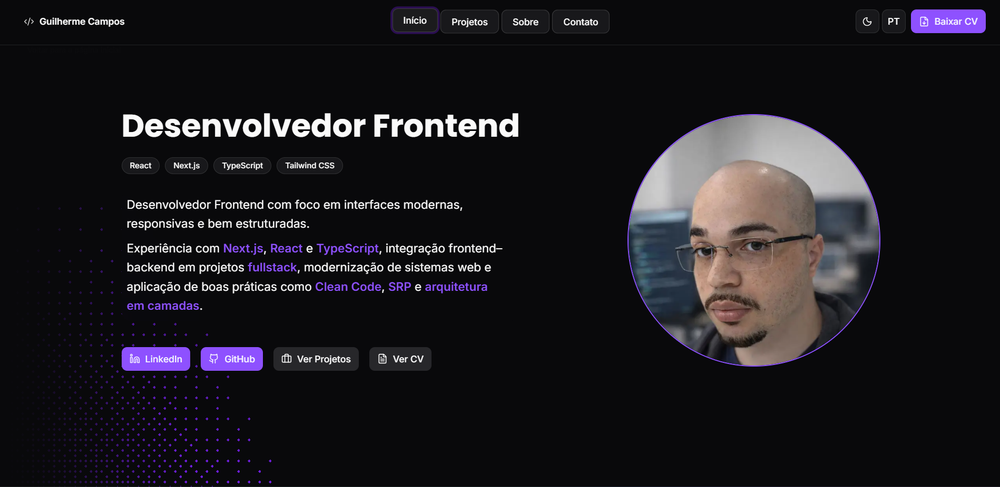

# Personal Portfolio


🚀 Personal portfolio developed to showcase my projects, skills, and experience as a **Frontend Developer**, focused on performance, accessibility, and clean architecture.

🔗 **Live demo:**  
https://guilherme-personal-portfolio.vercel.app

 

---

## ✨ Features

- ⚡ Built with **Next.js (App Router)**
- 🌍 Internationalization (PT / EN) with **react-i18next**
- 🎨 Modern UI with **Tailwind CSS** and reusable components
- 🧩 Clean architecture following **Clean Code** and **Single Responsibility Principle**
- 📱 Fully responsive (desktop & mobile)
- 🌗 Dark / Light theme toggle
- 🎬 Project demos with videos and detailed case studies
- 📄 Downloadable CV (PT / EN)

---

## 🧱 Tech Stack

- **Framework:** Next.js 14+
- **Language:** TypeScript
- **Styling:** Tailwind CSS
- **UI Components:** shadcn/ui, react-bits
- **Icons:** Lucide React
- **Animations:** Custom effects & motion utilities
- **Internationalization:** react-i18next
- **Deployment:** Vercel

---

## 📂 Project Structure

```txt
src/
├── app/            # App Router pages and layouts
├── components/     # Reusable UI and section components
├── constants/      # Static data (projects, stacks, menus)
├── hooks/          # Custom React hooks
├── i18n/           # Internationalization config and locales
├── icons/          # Custom SVG icon components
├── providers/      # Global providers (Theme, i18n, Intro)
├── schema/         # Validation schemas
├── utils/          # Helper functions

public/
├── doc/            # CV files (PT / EN)
├── images/         # Images and previews
├── videos/         # Project demo videos
```

---

## ▶️ Running Locally

```bash
# Clone the repository
git clone https://github.com/The-Souza/personal-portfolio.git

# Install dependencies
npm install

# Run the development server
npm run dev
```

The application will be available at: http://localhost:3000

---

## 🌍 Environment Variables

This project does not require mandatory environment variables to run locally.

Optional variable used in production:

```
NEXT_PUBLIC_SITE_URL=https://your-domain.com
```

---

## 📄 License

This project is licensed under the MIT License. \
Feel free to use it as inspiration, but please give proper credit if you reuse significant parts.

---

## 👨‍💻 Author

Guilherme Campos \
Frontend Developer

- GitHub: https://github.com/The-Souza
- LinkedIn: https://linkedin.com/in/guilherme-campos-frontend